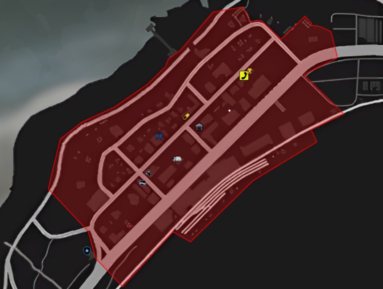

# Banco de Paleto

Perimetro:

<figure><figcaption></figcaption></figure>

* **Bandidos**: Obrigatório 10.
* **Máximo de policiais**: 12.
* **Armamento:** Todos de Rifle.
* **Negociação**: Inexistente, ação de confronto direto com a polícia. É obrigatório os bandidos esperarem o início da ação. A ação será iniciada somente quando a polícia entrar no perímetro da ação, helicóptero só poderá ter o piloto.
* **Refém**: Proibido
* **Obs**: Máximo de 6 pessoas dentro do GALINHEIRO.
